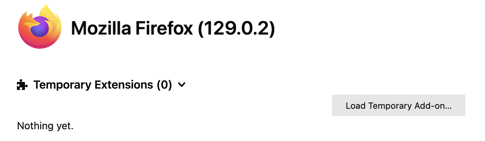
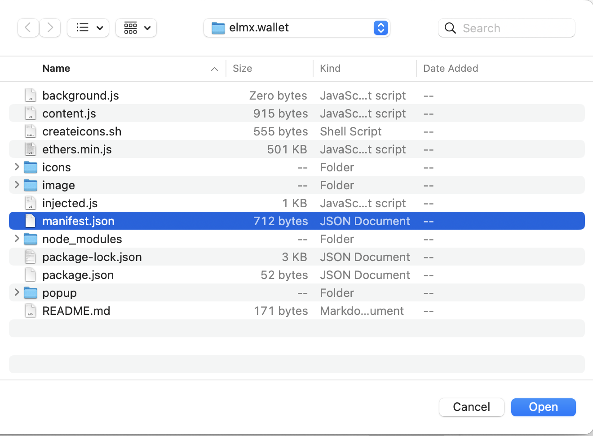
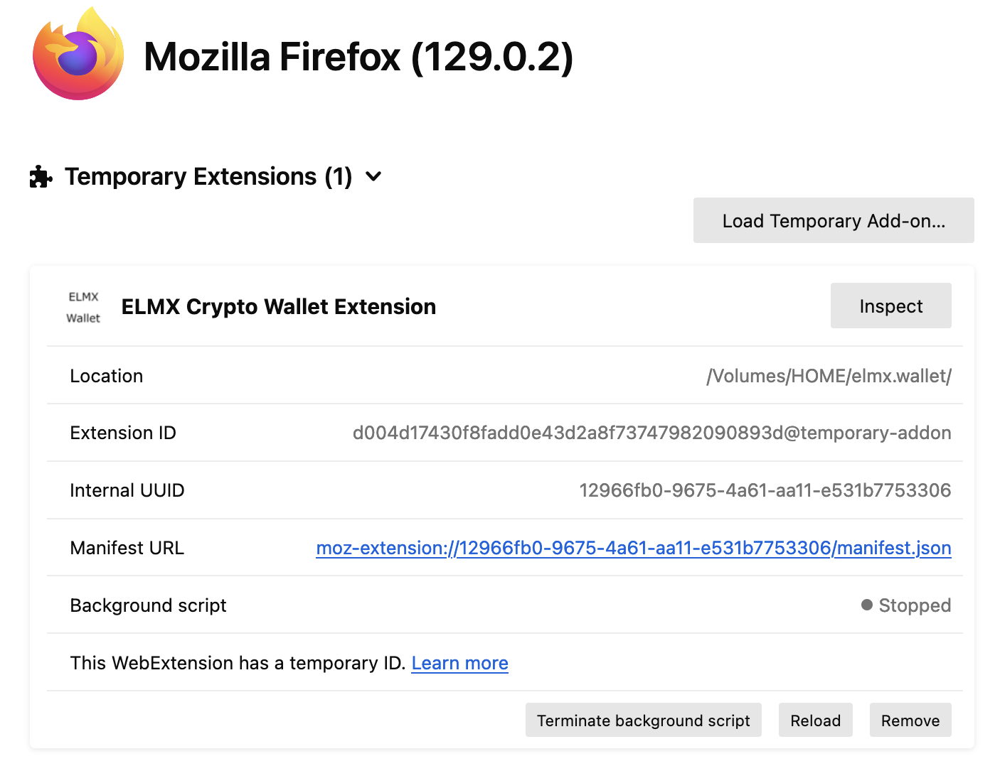

# elmx.wallet

A cryptocurrency wallet that is truly client-based to maintain client privacy

## Prerequisite

```
npm i web-ext -g
```

## Package

```
web-ext build
```

## Testing

Visit firefox at [about:debugging#/runtime/this-firefox](about:debugging#/runtime/this-firefox),



and press "Load Temporary Add-on" and select manifest.json for the extension,



then will show,


